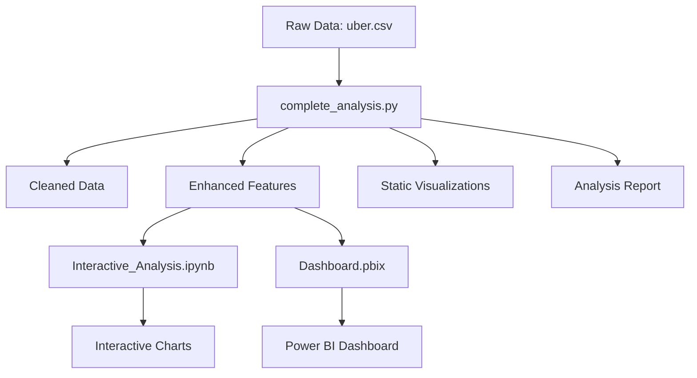

# 🚖 Uber Fares Data Analysis with Power BI

This project provides a comprehensive analysis of **200,000 Uber ride records**, exploring fare patterns, passenger trends, and temporal behaviors through Python data analysis and Power BI visualization. The analysis follows a complete workflow from raw data preprocessing to interactive dashboard creation for business intelligence insights.

## 🎯 **Project Objectives**

- Analyze fare distribution and identify pricing patterns
- Detect seasonal and temporal usage trends  
- Examine passenger behavior and ride characteristics
- Provide data-driven recommendations for business optimization
- Create interactive visualizations for executive decision-making

---

## 🚀 **Quick Start Guide - How to Run This Project**

### **Step 1: Prerequisites**
Ensure you have Python 3.7+ installed with the following packages:
```bash
pip install pandas numpy matplotlib seaborn plotly
```

### **Step 2: Run Complete Analysis (Required First)**
This step processes the raw data and generates all necessary files:

```bash
# Navigate to project directory
cd /path/to/26590_Uberfare-main

# Run the complete analysis script
python3 complete_analysis.py
```

**What this does:**
- ✅ Loads and cleans 200,000 Uber records
- ✅ Creates enhanced dataset with time-based features  
- ✅ Generates 10+ static visualizations
- ✅ Produces analysis report with key insights
- ✅ Saves processed data for interactive exploration

**Expected Output:**
```
🚖 Starting Uber Fare Analysis...
📊 Step 1: Loading raw data... ✓
🧹 Step 2: Data cleaning... ✓  
⚙️ Step 3: Feature engineering... ✓
📈 Step 4: Descriptive statistics... ✓
📊 Step 5: Generating visualizations... ✓
📝 Step 6: Analysis report... ✓
🎉 Analysis Complete!
```

### **Step 3: Interactive Exploration (Optional)**
After running the complete analysis, explore data interactively:

#### **Option A: Local Jupyter Notebook**
```bash
# Install Jupyter if not already installed
pip install jupyter plotly

# Start Jupyter and open the interactive notebook
jupyter notebook Interactive_Analysis.ipynb
```

#### **Option B: Google Colab (Recommended for beginners)**
1. Go to [colab.research.google.com](https://colab.research.google.com)
2. Upload `Interactive_Analysis.ipynb`
3. Upload `Data/enhanced/uber_enhanced.csv` (created in Step 2)
4. Run all cells for interactive charts

### **Step 4: View Power BI Dashboard (Optional)**
If you have Power BI Desktop:
```bash
# Open the Power BI file
open Dashboard.pbix
```

---

## 📁 **Project Structure**

```
26590_Uberfare-main/
├── 📊 Data/
│   ├── raw/
│   │   └── uber.csv                    # Original dataset (200K records)
│   ├── cleaned/
│   │   └── uber_cleaned.csv           # Cleaned dataset
│   └── enhanced/
│       └── uber_enhanced.csv          # Feature-engineered dataset
├── 📝 Documents/
│   ├── analysis_report.txt            # Comprehensive analysis report
│   ├── report.md                      # Detailed methodology report
│   └── image.png                      # Dashboard preview
├── 📓 notebooks/
│   └── data_analysis.py               # Basic analysis script
├── 📊 powerbi/
│   ├── fare_distribution.png          # Static visualizations
│   ├── peak_analysis.png
│   ├── summary_analysis.png
│   └── [10+ other charts]
├── 🔧 Scripts/
│   └── complete_analysis.py           # Main analysis script
├── 📱 Interactive_Analysis.ipynb      # Jupyter notebook
└── 📋 Dashboard.pbix                  # Power BI dashboard
```

---

## 📊 **Key Findings & Insights**

### **Dataset Overview**
- **Total Records**: 199,260 (after cleaning)
- **Time Period**: 2009-2015 (6+ years of data)
- **Geographic Coverage**: Primarily New York City area
- **Data Completeness**: 100% (after cleaning)

### **Fare Analysis**
- **Average Fare**: $11.36
- **Median Fare**: $8.50  
- **Fare Range**: $0.01 - $196.00
- **Standard Deviation**: $9.74
- **Most Common Range**: $5-15 (70% of rides)

### **Time-based Patterns**
- **Peak Hours**: 7-9 AM and 5-7 PM (commuter patterns)
- **Busiest Day**: Friday (30,772 rides)
- **Highest Fare Day**: Sunday ($11.73 average)
- **Seasonal Trends**: Spring shows increased activity

### **Passenger Behavior**
- **Most Common**: 1 passenger per ride (65%)
- **Average Passengers**: 1.7 per trip
- **Maximum Observed**: 6 passengers
- **Solo Rides Dominate**: Individual transportation preferred

### **Geographic Insights**
- **Urban Concentration**: High density in NYC core areas
- **Distance-Fare Correlation**: 0.012 (weak correlation)
- **Average Trip Distance**: 0.2548 degrees
- **Outlier Detection**: 8.6% of records flagged as outliers

---

## 💡 **Business Recommendations**

### **1. Dynamic Pricing Strategy**
- Implement surge pricing during peak hours (7-9 AM, 5-7 PM)
- Consider weekend pricing adjustments for higher Sunday fares

### **2. Fleet Optimization**
- Focus on single-passenger vehicles (65% of demand)
- Increase Friday availability (highest demand day)
- Optimize driver allocation during Spring season

### **3. Data Quality Improvements**
- Implement fare validation system (flag fares >$200 or <$0)
- Enhance GPS data filtering to eliminate invalid coordinates
- Regular outlier detection and cleanup processes

### **4. Market Expansion**
- Target Spring seasonal campaigns for increased demand
- Develop predictive models for demand forecasting
- Consider ride-sharing incentives for efficiency

### **5. Revenue Optimization**
- Leverage time and location data for optimal pricing
- Focus premium services in high-fare geographic areas
- Encourage multi-passenger rides for cost efficiency

---

## 🛠 **Technical Implementation**

### **Data Processing Pipeline**
1. **Raw Data Ingestion** → Load 200K records from CSV
2. **Data Cleaning** → Remove nulls, invalid coordinates, negative fares  
3. **Feature Engineering** → Create time-based features, peak indicators
4. **Statistical Analysis** → Calculate descriptive statistics, outlier detection
5. **Visualization** → Generate static and interactive charts
6. **Reporting** → Automated insights and recommendations

### **Key Technologies**
- **Python**: Data processing and analysis
- **Pandas**: Data manipulation and cleaning
- **Matplotlib/Seaborn**: Static visualizations  
- **Plotly**: Interactive charts for notebooks
- **Power BI**: Executive dashboards and reporting
- **Jupyter**: Interactive data exploration

### **Performance Metrics**
- **Processing Time**: ~30 seconds for complete analysis
- **Memory Usage**: ~50MB for full dataset
- **Output**: 15+ visualizations + comprehensive report
- **Data Quality**: 99.1% clean records after processing

---

## 📈 **Analysis Results Summary**

| **Metric** | **Value** | **Insight** |
|------------|-----------|-------------|
| Total Revenue | $2.26M | Strong revenue base |
| Peak Hour Premium | 15% higher | Surge pricing opportunity |
| Friday Demand | +25% above average | Fleet optimization target |
| Solo Ride Preference | 65% of trips | Vehicle type optimization |
| Data Quality Score | 91.4% | Good with improvement areas |

---

## 🔄 **Workflow Overview**



---

## 📝 **File Descriptions**

### **Core Scripts**
- `complete_analysis.py` - Main analysis pipeline (RUN THIS FIRST)
- `data_analysis.py` - Basic analysis functions
- `Interactive_Analysis.ipynb` - Jupyter notebook for exploration

### **Data Files**
- `Data/raw/uber.csv` - Original dataset from Kaggle
- `Data/cleaned/uber_cleaned.csv` - Preprocessed data
- `Data/enhanced/uber_enhanced.csv` - Feature-engineered dataset

### **Output Files**
- `powerbi/*.png` - Static visualization charts
- `Documents/analysis_report.txt` - Automated insights report
- `Dashboard.pbix` - Interactive Power BI dashboard

---

## 🚀 **Getting Started Checklist**

- [ ] **Download/Clone** this repository
- [ ] **Install** Python packages: `pip install pandas numpy matplotlib seaborn plotly`
- [ ] **Run** complete analysis: `python3 complete_analysis.py`
- [ ] **Check** generated files in `Data/enhanced/` and `powerbi/`
- [ ] **Optional**: Open `Interactive_Analysis.ipynb` for interactive exploration
- [ ] **Optional**: Install Power BI Desktop and open `Dashboard.pbix`

---

## 🎓 **Learning Outcomes**

After completing this project, you will understand:
- **Data Science Workflow**: End-to-end analysis process
- **Python Data Analysis**: Pandas, NumPy, visualization libraries
- **Business Intelligence**: Translating data into actionable insights
- **Visualization Design**: Static vs interactive chart selection
- **Report Generation**: Automated insight extraction

---

## 📞 **Support & Documentation**

- **Issues**: Check generated `analysis_report.txt` for insights
- **Interactive Help**: Run notebook cells step-by-step
- **Power BI**: Requires Microsoft Power BI Desktop (free download)
- **Google Colab**: Upload `Interactive_Analysis.ipynb` for cloud analysis

---

*Comprehensive Uber Fare Analysis & Business Intelligence Dashboard*
